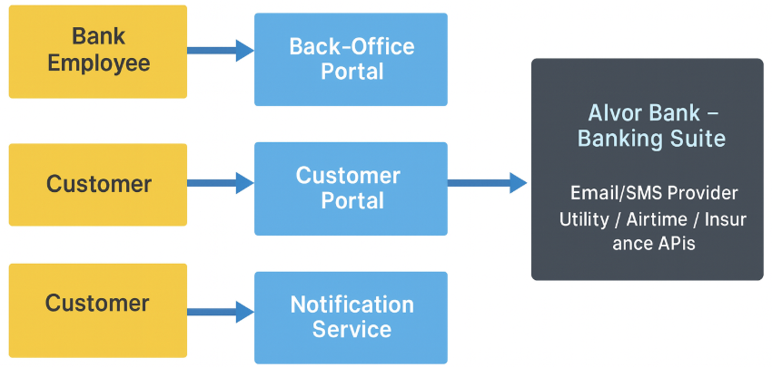
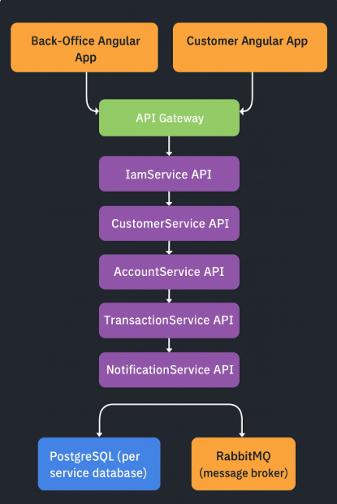

# Chapter 02 — Domain Architecture of a Digital Bank

In Chapter 01 we set the vision for **Alvor Bank – Banking Suite**.  
Now we turn that vision into a **domain architecture**: bounded contexts, services, messaging and key workflows.

By the end of this chapter, you should be able to:

- Name the **main bounded contexts** of the system and what each is responsible for.
- Explain which microservice **owns which data** and which rules.
- Understand how **RabbitMQ + MassTransit** fit into the picture as the event backbone.
- Visualise the system using **C4-style context and container diagrams** (described in text here, with actual diagrams added later).
- See how back-office and customer UI flows map to backend services.

We still won’t write code yet; this chapter is all about **structure and language**.

---

## 2.1 Why domain architecture first?

Before we open Visual Studio or run `ng new`, we need clarity on:

- What are the **core concepts** in our bank?
- How do we **slice responsibilities** into services?
- Which service **owns** which data?
- How do services **talk to each other** (HTTP vs events)?

Getting this wrong leads to:

- Services that know too much about each other.
- “God services” that own _everything_.
- Painful refactors once you start adding features.

Getting this **good enough** up front gives us:

- Clear **bounded contexts** with well-defined responsibilities.
- A consistent way to grow the platform as new requirements appear.
- A mental model that you (and future teammates) can actually hold in your head.

---

## 2.2 The core domains revisited

From Chapter 01, we identified these main functional areas:

- **IAM** – who you are and what you are allowed to do.
- **Customer** – who the bank’s customers are from a KYC and profile point of view.
- **Accounts** – where money “sits”.
- **Transactions & Payments** – how money moves and how everyday payments are initiated.
- **Notifications** (supporting) – how we inform users about important events.
- **API Gateway** (supporting) – how external clients talk to the system.

We’ll model each of these as a **bounded context** with its own domain model and its own microservice.

Later chapters will add more details and diagrams, but right now we need a **high-level cut**.

---

## 2.3 Bounded contexts and microservices

At the highest level, Alvor Bank will have the following backend services:

- `IamService`
- `CustomerService`
- `AccountService`
- `TransactionService`
- `NotificationService`
- `ApiGateway` (YARP or similar reverse proxy)

And two primary frontends:

- **Back-office Angular app** (for staff)
- **Customer Angular app** (for end users)

Each service owns its **own database** and follows the same **Clean Architecture** pattern (Domain, Application, Infrastructure, API). Let’s look at each context in more detail.

### 2.3.1 IAM context

**Responsibility**

Everything related to _identity_ and _access_:

- Users (staff + customers)
- Credentials (passwords, 2FA secrets)
- Roles and permissions
- Security policies (lockouts, password rules)
- Tokens (JWT issuing and validation keys)

**Owns**

- User accounts and security-critical fields
- Roles and role assignments
- Authentication flows and 2FA configuration

**Does not own**

- Customer KYC details
- Account balances or transactions

Other services ask IAM:

- “Who is this user?”
- “What roles/permissions do they have?”

IAM answers via JWT claims and (later) via introspection endpoints.

---

### 2.3.2 Customer context

**Responsibility**

The **business view of the customer**:

- Customer profiles
  - Personal details (name, contact info)
  - KYC information (documents, verification status)
- Onboarding workflows
  - Creating a new customer
  - Collecting required KYC data
  - Tracking verification and risk flags

**Owns**

- Customer entities and KYC attributes
- Onboarding and verification state

**Does not own**

- Login credentials (owned by IAM)
- Account balances (owned by Accounts)

Typical interactions:

- Back-office agents create or update customers.
- IAM may create a login for a verified customer.
- CustomerService may publish events such as `CustomerOnboarded` or `CustomerVerified`.

---

### 2.3.3 Accounts context

**Responsibility**

Where **money lives**:

- Accounts: current, savings (and later: more types)
- Ownership: which customer(s) own each account
- Balances and basic invariants
- Account lifecycle (opened, blocked, closed)

**Owns**

- Account entities, account numbers and currency
- Current/available balances

**Does not own**

- Detailed transaction history (primarily TransactionService)
- Customer personal details (CustomerService)

Typical interactions:

- Back-office staff open accounts for customers.
- The TransactionService calls Accounts to validate that an account is usable for a transaction.
- Accounts may publish events such as `AccountOpened` or `AccountClosed`.

---

### 2.3.4 Transactions & Payments context

**Responsibility**

Where **money moves**:

- Posting internal transactions between accounts
- Maintaining a **transaction history** per account
- Enforcing basic accounting rules (sum of debits = sum of credits)
- Initiating **everyday digital banking operations**:
  - Buying **electricity tokens**
  - Buying **prepaid airtime/data**
  - Paying **insurance premiums** and other simple bills
- Emitting **domain events** such as:
  - `TransactionPosted`
  - `PaymentInitiated`
  - `PaymentCompleted`
  - `PaymentFailed`

These events will be published to **RabbitMQ** using **MassTransit** so that other services (like Notifications or Reporting) can react asynchronously.

**Owns**

- Transaction records and payment instructions
- Business rules around how and when we can post transactions

**Does not own**

- Account master data (AccountService)
- Customer identity (CustomerService / IAM)

---

### 2.3.5 Notifications context (supporting)

**Responsibility**

Turning **technical events** into **human-readable messages**:

- Listening for events like `CustomerOnboarded`, `AccountOpened`, `PaymentCompleted`, `LoginFromNewDevice`
- Sending notifications via:
  - Email
  - SMS
  - Push (or a simplified variant)

**Owns**

- Notification templates and (optionally) notification preferences
- Notification history (if we choose to store it)

**Does not own**

- Business rules for IAM, Customers, Accounts, or Transactions

Notifications is a **pure consumer** of events:

- It subscribes to RabbitMQ topics via **MassTransit**, formats messages, and sends them via external providers.

---

### 2.3.6 API Gateway and frontends (supporting)

The **API Gateway**:

- Acts as a single entry point for the Angular frontends and Postman collections.
- Routes requests to the correct microservice (IAM, Customers, Accounts, Transactions).
- Can apply cross-cutting concerns (e.g., global logging, correlation IDs).

The **Angular frontends**:

- Call the gateway instead of talking directly to each service.
- Use JWT tokens from IAM for authentication and role-based routing.
- Present flows that span multiple services (for example, “Customer onboarding” uses IAM + CustomerService).

---

## 2.4 Ubiquitous language

A key DDD concept is the **ubiquitous language**: shared terms we use consistently in code, docs and discussions.

Here are some important terms we’ll use:

| Term              | Meaning                                                                                | Owned by            |
| ----------------- | -------------------------------------------------------------------------------------- | ------------------- |
| User              | A person with login credentials (staff or customer)                                    | IAM                 |
| Customer          | A bank customer with KYC details and relationship to the bank                          | CustomerService     |
| Account           | A bank account (current, savings, etc.) with a number and balance                      | AccountService      |
| Transaction       | A posting that moves value between accounts (debit/credit entries)                     | TransactionService  |
| Payment           | A business operation that may result in one or more transactions (e.g. airtime top-up) | TransactionService  |
| Electricity Token | A prepaid electricity voucher purchased via the bank                                   | TransactionService  |
| Airtime Top-up    | A prepaid airtime/data purchase                                                        | TransactionService  |
| Insurance Premium | A recurring or one-off payment to an insurance provider                                | TransactionService  |
| Event             | A message emitted after something important happens (e.g. `AccountOpened`)             | Emitting context    |
| Notification      | A user-facing email/SMS/push triggered by one or more events                           | NotificationService |

We’ll reinforce this language in **entity names, DTOs, events and UI labels**.

---

## 2.5 C4-style view of the system

We’ll use a simplified **C4 model** to describe the architecture:

- **Level 1 – System Context:** Who uses the system and what else it talks to.
- **Level 2 – Containers:** The major deployable pieces (services, frontends, databases, message broker).

Later in the book we’ll generate diagrams as PNG/SVG. For now, we describe them in text and with simple ASCII layouts.

### 2.5.1 System context

At the system context level, we have:

- **Actors**

  - **Bank Employee** – uses the back-office portal to manage customers, accounts and payments.
  - **Customer** – uses the customer portal to see balances and perform operations (tokens, airtime, insurance, transfers).

- **Alvor Bank – Banking Suite (System)**

  - Provides secure access for both actors.
  - Manages accounts, transactions, payments and notifications.

- **External systems**
  - **Email/SMS Provider** – used by NotificationService.
  - **Utility Provider API** – used for electricity tokens.
  - **Airtime Aggregator** – used for airtime/data top-ups.
  - **Insurance Provider API** – used for premium payments.

You can imagine the diagram as:

```text
Bank Employee  --->  Back-Office Portal  --->  Alvor Bank – Banking Suite  --->  Email/SMS Provider
Customer       --->  Customer Portal     --->                              --->  Utility / Airtime / Insurance APIs
```



### 2.5.2 Container view

At the container level, we zoom into the system and see services and infrastructure:

```text
+-------------------------+      +----------------------------+
| Back-Office Angular App |      | Customer Angular App       |
+-----------+-------------+      +-------------+--------------+
            |                                   |
            v                                   v
                +----------------------------+
                |       API Gateway         |
                +-------------+-------------+
                              |
                +-------------+-------------+
                |    IamService API         |
                +-------------+-------------+
                |    CustomerService API    |
                +-------------+-------------+
                |    AccountService API     |
                +-------------+-------------+
                |  TransactionService API   |
                +-------------+-------------+
                | NotificationService API   |
                +--------------------------+
                              |
             +----------------+----------------+
             |                                 |
             v                                 v
   +-------------------+             +-----------------+
   | PostgreSQL (per   |             | RabbitMQ        |
   | service database) |             | (message broker)|
   +-------------------+             +-----------------+
```



Each service:

- Has its **own database** (PostgreSQL schema or instance).
- Connects to **RabbitMQ** to publish/consume events using **MassTransit**.
- Is wrapped in a Docker container.

The API Gateway is also a container, routing traffic to these services.

---

## 2.6 Key workflows

To make this architecture concrete, let’s walk through a few important workflows.

### 2.6.1 Customer onboarding and first login

1. A back-office agent opens the **Back-Office Portal** and logs in via IAM.
2. The agent starts a **“New Customer”** workflow in the Customer app (calling `CustomerService`).
3. CustomerService stores KYC data and marks the customer as `PendingVerification`.
4. Once verification passes, CustomerService marks the customer as `Verified` and publishes a `CustomerVerified` event via RabbitMQ.
5. A consumer in `IamService` listens for `CustomerVerified` and:
   - Creates a corresponding IAM user (if not already created).
   - Sends a “set password” / “welcome” notification via NotificationService.
6. The customer receives an email/SMS with a link to set their password and logs in through the **Customer Portal**.

At the end of this flow, we have:

- A verified customer profile in CustomerService.
- A corresponding User in IAM with credentials.
- A first login through the customer UI.

---

### 2.6.2 Opening an account

1. A back-office agent selects a verified customer in the Back-Office Portal.
2. The agent initiates **“Open Account”** (calls `AccountService` with the customer ID and account type).
3. AccountService:
   - Validates that the customer exists and is eligible (it may call CustomerService or use cached data).
   - Creates a new account with initial balance and status `Active`.
   - Publishes `AccountOpened` event via RabbitMQ.
4. NotificationService listens to `AccountOpened` and sends an email/SMS to the customer.

The customer can now see their account when they log into the Customer Portal.

---

### 2.6.3 Buying an electricity token (example payment flow)

1. A customer logs into the **Customer Portal** and selects **“Buy Electricity Token”**.
2. The UI collects:
   - Meter number
   - Amount
   - Source account
3. The UI calls an endpoint in the `TransactionService` (`POST /payments/electricity`).
4. TransactionService:
   - Validates the request (e.g., sufficient funds by querying AccountService).
   - Posts the accounting entries (debit from the customer’s account, credit to a “utility clearing account”).
   - Calls the external **Utility Provider API** to actually buy the token.
   - Saves the token and basic metadata in its own database.
   - Publishes `PaymentCompleted` (or `PaymentFailed`) event via RabbitMQ.
5. NotificationService listens for `PaymentCompleted` and sends:
   - An SMS or email with the token code and amount.
6. The customer sees the transaction and token in their **Customer Portal** history.

Later, airtime top-ups and insurance payments follow a similar pattern with different external APIs.

---

### 2.6.4 Failed login and lockout

1. A user attempts to log in via IAM.
2. IAM checks the credentials:
   - If incorrect, increments `AccessFailedCount`.
3. After **3 failed attempts**, IAM:
   - Locks the account for a configured period.
   - Publishes a `UserLockedOut` event (optional but recommended).
4. NotificationService listens to `UserLockedOut` and sends a warning email/SMS.

The frontends show a clear error message when the account is locked.

---

## 2.7 Where RabbitMQ + MassTransit fit in

So far we’ve mentioned events a lot. Here’s how they fit in technically.

- **RabbitMQ** is our **message broker**:

  - Services publish and consume messages via exchanges and queues.
  - It runs as a container in our Docker environment.

- **MassTransit** is a **.NET library** that:
  - Hides most of the RabbitMQ boilerplate.
  - Lets us publish and consume strongly-typed messages.
  - Integrates nicely with ASP.NET Core and dependency injection.

We’ll mostly use **events** rather than commands:

- Events are things that **have happened**:

  - `CustomerVerified`
  - `AccountOpened`
  - `PaymentCompleted`
  - `UserLockedOut`

- Services **decide how to react** to these events:
  - IAM reacts to `CustomerVerified`.
  - NotificationService reacts to many events.
  - Reporting (if added) could react to all of them for analytics.

When we get to the implementation chapters, you’ll see:

- A shared **message contract library** for event types.
- MassTransit configuration per service.
- Integration tests that ensure events are published and consumed correctly.

---

## 2.8 How this shapes the code structure

The domain architecture we’ve just defined has a direct impact on how we structure code.

In the main source repository, the backend will roughly look like:

```text
digital-banking-suite/
└─ src/
   └─ backend/
      ├─ BuildingBlocks/
      │  ├─ BankingSuite.BuildingBlocks.Domain/
      │  ├─ BankingSuite.BuildingBlocks.Application/
      │  └─ BankingSuite.BuildingBlocks.Infrastructure/
      │
      ├─ Services/
      │  ├─ IamService/
      │  │  ├─ BankingSuite.IamService.Domain/
      │  │  ├─ BankingSuite.IamService.Application/
      │  │  ├─ BankingSuite.IamService.Infrastructure/
      │  │  └─ BankingSuite.IamService.API/
      │  ├─ CustomerService/
      │  ├─ AccountService/
      │  ├─ TransactionService/
      │  └─ NotificationService/
      │
      └─ ApiGateway/
         └─ BankingSuite.ApiGateway/
```

Each service follows the same pattern:

- **Domain** – Entities, value objects, aggregates, domain events, domain services.
- **Application** – CQRS commands, queries, DTOs, application services.
- **Infrastructure** – EF Core, PostgreSQL, Identity (for IAM), MassTransit + RabbitMQ, external APIs.
- **API** – FastEndpoints definitions, request/response mapping, authentication, Swagger.

We’ll also have:

- `tests/` – unit + integration tests per service.
- `infra/` – Docker compose with:
  - One container per microservice
  - One Postgres container per service (or schema, depending on how we set it up)
  - One RabbitMQ container

The **Angular workspace** under `src/frontend/` will reflect the same bounded contexts with feature libraries like:

- `auth`
- `customers`
- `accounts`
- `transactions`

and separate apps:

- `backoffice-app`
- `customer-app`

---

## 2.9 Looking ahead

In the next chapters we’ll start turning this architecture into something tangible.

- In **Chapter 03**, we’ll set up the **development environment and repositories**, including:

  - .NET 10 SDK, Angular 21, Nx, Visual Studio 2026
  - Git branching strategy
  - Initial solution and folder structure

- In **Chapter 04 and beyond**, we’ll:
  - Introduce Docker, tests and CI early.
  - Create the **BuildingBlocks** projects.
  - Scaffold the skeleton of our microservices.
  - Then dive deep into the **IAM service** as the first real implementation.

From there, we’ll repeat the **backend + messaging + frontend** pattern for **Customers, Accounts and Transactions/Payments**, always guided by the domain architecture you’ve just seen.

With the big picture in place, we’re ready to start building.
