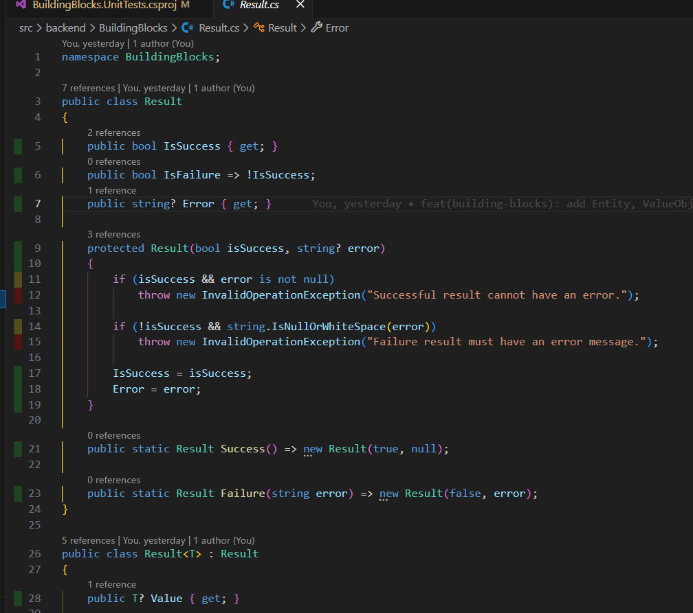
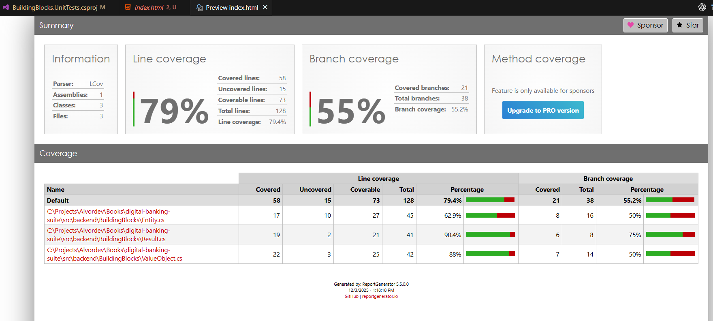

# Chapter 6 — Backend Testing Foundations

So far in Part II, we:

- Containerized our first placeholder backend service (`AccountService.Api`) with Docker and docker-compose.
- Created a **backend solution** (`BankingSuite.Backend.sln`) and a **shared `BuildingBlocks` library** containing `Entity`, `ValueObject`, and `Result`.

In this chapter, we add the next critical piece: **automated tests**.

By the end of this chapter, you will:

- Understand the basic **testing strategy** for the Banking Suite backend.
- Create a **test project** for the backend (`BuildingBlocks.UnitTests`).
- Add the first **meaningful tests** for `Result`, `ValueObject`, and `Entity`.
- Wire backend tests into **GitHub Actions** so every PR runs tests.
- Generate **code coverage reports**, view them in **VS Code**, and publish them as artifacts in **GitHub Actions**.

---

## 6.1 Git Setup for This Chapter (Feature Branch)

As always, this chapter’s work lives in its own feature branch.

> **Each build chapter gets its own feature branch.**  
> We only merge back to `develop` after the chapter is complete and CI is green.

For this chapter we’ll use:

- Branch name: `feature/ch06-backend-testing-foundations`

From your local clone:

```bash
cd digital-banking-suite

# Make sure you're on develop and up to date
git checkout develop
git pull origin develop

# Create a new branch for this chapter
git checkout -b feature/ch06-backend-testing-foundations
```

All changes for this chapter (test project, test code, coverage setup, CI updates, docs) will happen on this branch.

T> This chapter is intentionally small but important. You’ll feel its impact every time CI catches a bug before it hits `develop`.

---

## 6.2 Testing Strategy for the Banking Suite

We’re building a **real** banking platform, not a toy project. That means we care about:

- **Fast feedback** – tests should run on every PR.
- **Clear layers** – unit tests for core domain and building blocks, integration tests for services.
- **Confidence** – catching regressions before they reach production.

We’ll use a layered approach:

- **Unit tests**:
  - Pure C# tests.
  - No network, no Docker, no database.
  - Focused on domain logic and building blocks (`Entity`, `ValueObject`, `Result`, aggregates, domain services).
- **Integration tests** (later chapters):
  - Exercising microservices via HTTP or messaging.
  - Using test containers or docker-compose for dependencies (PostgreSQL, RabbitMQ).

In this chapter, we start with:

- **Unit tests for `BuildingBlocks`**:
  - `Result` – ensure success/failure behaves correctly.
  - `ValueObject` – equality semantics.
  - `Entity` – identity-based equality.

I> Starting with shared building blocks is a great way to ensure the foundation is solid before we build business-critical logic on top of it.

---

## 6.3 Creating the Backend Test Project

We’ll begin by creating a dedicated **xUnit** test project for the `BuildingBlocks` library.

From the backend folder:

```bash
cd digital-banking-suite/src/backend

# Create xUnit test project for BuildingBlocks
dotnet new xunit \
  -n BuildingBlocks.UnitTests \
  -o BuildingBlocks.UnitTests
```

This creates:

```text
src/backend/
  BankingSuite.Backend.sln
  BuildingBlocks/
    BuildingBlocks.csproj
    Entity.cs
    ValueObject.cs
    Result.cs
  BuildingBlocks.UnitTests/
    BuildingBlocks.UnitTests.csproj
    UnitTest1.cs
  AccountService/
    AccountService.Api/
      AccountService.Api.csproj
```

Now add the test project to the backend solution:

```bash
dotnet sln BankingSuite.Backend.sln add ./BuildingBlocks.UnitTests/BuildingBlocks.UnitTests.csproj
```

We also need the test project to reference the `BuildingBlocks` project:

```bash
dotnet add ./BuildingBlocks.UnitTests/BuildingBlocks.UnitTests.csproj \
  reference ./BuildingBlocks/BuildingBlocks.csproj
```

You can now build the solution to verify everything compiles:

```bash
dotnet build BankingSuite.Backend.sln
```

If this succeeds, the test project and building blocks are wired correctly.

T> For now, we’re only adding tests for `BuildingBlocks`. Later, we’ll create more test projects like `AccountService.UnitTests`, `IAMService.UnitTests`, etc.

---

## 6.4 Cleaning Up the Default Test Class

The `dotnet new xunit` template creates a default `UnitTest1.cs`. Let’s remove it and create our own tests.

From `src/backend`:

```bash
cd digital-banking-suite/src/backend

rm BuildingBlocks.UnitTests/UnitTest1.cs
```

Now we’ll add our own test classes in the next sections.

---

## 6.5 Testing the Result Type

We want to be confident that `Result` and `Result<T>` behave as expected:

- `Result.Success()` → `IsSuccess == true`, `IsFailure == false`, `Error == null`.
- `Result.Failure("error")` → `IsSuccess == false`, `IsFailure == true`, `Error` contains our message.
- The same semantics for `Result<T>`.

First, we’ll add `coverlet.msbuild` so this test project can produce coverage (we’ll use it later).

Open `src/backend/BuildingBlocks.UnitTests/BuildingBlocks.UnitTests.csproj` and ensure it looks like this (versions can differ slightly):

```xml
<Project Sdk="Microsoft.NET.Sdk">

  <PropertyGroup>
    <TargetFramework>net9.0</TargetFramework>
  </PropertyGroup>

  <ItemGroup>
    <PackageReference Include="xunit" Version="2.9.0" />
    <PackageReference Include="xunit.runner.visualstudio" Version="2.8.2">
      <PrivateAssets>all</PrivateAssets>
      <IncludeAssets>runtime; build; native; contentfiles; analyzers; buildtransitive</IncludeAssets>
    </PackageReference>

    <!-- Coverage support via Coverlet -->
    <PackageReference Include="coverlet.msbuild" Version="6.0.0">
      <PrivateAssets>all</PrivateAssets>
      <IncludeAssets>runtime; build; native; contentfiles; analyzers; buildtransitive</IncludeAssets>
    </PackageReference>
  </ItemGroup>

  <ItemGroup>
    <ProjectReference Include="..\BuildingBlocks\BuildingBlocks.csproj" />
  </ItemGroup>

</Project>
```

Restore packages:

```bash
cd digital-banking-suite/src/backend
dotnet restore BuildingBlocks.UnitTests/BuildingBlocks.UnitTests.csproj
```

Now create `src/backend/BuildingBlocks.UnitTests/ResultTests.cs`:

```csharp
using BuildingBlocks;
using Xunit;

namespace BuildingBlocks.UnitTests;

public class ResultTests
{
    [Fact]
    public void Success_Should_Set_IsSuccess_True_And_IsFailure_False()
    {
        // Act
        var result = Result.Success();

        // Assert
        Assert.True(result.IsSuccess);
        Assert.False(result.IsFailure);
        Assert.Null(result.Error);
    }

    [Fact]
    public void Failure_Should_Set_IsSuccess_False_And_Error_Message()
    {
        // Arrange
        var errorMessage = "Something went wrong";

        // Act
        var result = Result.Failure(errorMessage);

        // Assert
        Assert.False(result.IsSuccess);
        Assert.True(result.IsFailure);
        Assert.Equal(errorMessage, result.Error);
    }

    [Fact]
    public void ResultOfT_Success_Should_Contain_Value()
    {
        // Arrange
        var value = 42;

        // Act
        var result = Result<int>.Success(value);

        // Assert
        Assert.True(result.IsSuccess);
        Assert.Equal(value, result.Value);
        Assert.Null(result.Error);
    }

    [Fact]
    public void ResultOfT_Failure_Should_Not_Contain_Value()
    {
        // Arrange
        var errorMessage = "Failure with generic type";

        // Act
        var result = Result<int>.Failure(errorMessage);

        // Assert
        Assert.True(result.IsFailure);
        Assert.Equal(errorMessage, result.Error);
        Assert.Equal(default, result.Value);
    }
}
```

Run the tests locally:

```bash
cd digital-banking-suite/src/backend
dotnet test BankingSuite.Backend.sln
```

You should see the test project discovered and all tests passing.

---

## 6.6 Testing ValueObject Equality

Next, let’s verify that our `ValueObject` base class behaves correctly for equality and inequality.

To do that, we’ll:

1. Create a simple test-only value object, e.g. `TestMoney`.
2. Write tests that compare different instances.

Create `src/backend/BuildingBlocks.UnitTests/TestMoney.cs`:

```csharp
using BuildingBlocks;

namespace BuildingBlocks.UnitTests;

// Test-only value object to verify equality semantics
public sealed class TestMoney : ValueObject
{
    public decimal Amount { get; }
    public string Currency { get; }

    public TestMoney(decimal amount, string currency)
    {
        Amount = amount;
        Currency = currency;
    }

    protected override IEnumerable<object?> GetEqualityComponents()
    {
        yield return Amount;
        yield return Currency;
    }
}
```

Now create `src/backend/BuildingBlocks.UnitTests/ValueObjectTests.cs`:

```csharp
using Xunit;

namespace BuildingBlocks.UnitTests;

public class ValueObjectTests
{
    [Fact]
    public void Two_ValueObjects_With_Same_Values_Should_Be_Equal()
    {
        // Arrange
        var a = new TestMoney(100m, "USD");
        var b = new TestMoney(100m, "USD");

        // Act & Assert
        Assert.Equal(a, b);
        Assert.True(a == b);
        Assert.False(a != b);
    }

    [Fact]
    public void Two_ValueObjects_With_Different_Values_Should_Not_Be_Equal()
    {
        // Arrange
        var a = new TestMoney(100m, "USD");
        var b = new TestMoney(200m, "USD");

        // Act & Assert
        Assert.NotEqual(a, b);
        Assert.True(a != b);
        Assert.False(a == b);
    }

    [Fact]
    public void ValueObject_Should_Have_Consistent_HashCode_For_Equal_Values()
    {
        // Arrange
        var a = new TestMoney(50m, "EUR");
        var b = new TestMoney(50m, "EUR");

        // Act
        var hashA = a.GetHashCode();
        var hashB = b.GetHashCode();

        // Assert
        Assert.Equal(hashA, hashB);
    }
}
```

Run the tests again:

```bash
cd digital-banking-suite/src/backend
dotnet test BankingSuite.Backend.sln
```

You should now see a few more tests running and passing.

I> These tests are small, but they validate the “gravity” of your building blocks. Every future domain model that relies on `ValueObject` and `Result` will inherit these guarantees.

---

## 6.7 (Optional) Testing Entity Equality

Testing `Entity` is similar: we want to ensure entities with the same `Id` are considered equal.

This is optional at this stage, but it’s a good pattern to show.

Create `src/backend/BuildingBlocks.UnitTests/TestEntity.cs`:

```csharp
using BuildingBlocks;

namespace BuildingBlocks.UnitTests;

// Simple test-only entity for equality tests
public sealed class TestEntity : Entity
{
    public string Name { get; }

    public TestEntity(string name)
        : base()
    {
        Name = name;
    }

    public TestEntity(Guid id, string name)
        : base(id)
    {
        Name = name;
    }
}
```

Now create `src/backend/BuildingBlocks.UnitTests/EntityTests.cs`:

```csharp
using Xunit;

namespace BuildingBlocks.UnitTests;

public class EntityTests
{
    [Fact]
    public void Entities_With_Same_Id_Should_Be_Equal()
    {
        // Arrange
        var id = Guid.NewGuid();
        var entityA = new TestEntity(id, "A");
        var entityB = new TestEntity(id, "B");

        // Act & Assert
        Assert.Equal(entityA, entityB);
        Assert.True(entityA == entityB);
        Assert.False(entityA != entityB);
    }

    [Fact]
    public void Entities_With_Different_Id_Should_Not_Be_Equal()
    {
        // Arrange
        var entityA = new TestEntity(Guid.NewGuid(), "A");
        var entityB = new TestEntity(Guid.NewGuid(), "A");

        // Act & Assert
        Assert.NotEqual(entityA, entityB);
        Assert.True(entityA != entityB);
        Assert.False(entityA == entityB);
    }
}
```

Run tests again:

```bash
cd digital-banking-suite/src/backend
dotnet test BankingSuite.Backend.sln
```

All tests should still pass.

---

## 6.8 Visualizing Coverage in VS Code

Tests passing is great, but it’s even better when you can **see what they’re covering**.

In this section you’ll:

- Generate a coverage file from `dotnet test`.
- Use **Coverage Gutters** to show line coverage inside VS Code.
- Use **HTML Preview** (George Oliveira) to view a rich HTML coverage report **without leaving VS Code**.
- Ignore coverage artifacts in Git so they don’t pollute your repo.

A small but important detail:

I> The `CoverletOutput` path is **relative to each test project’s `.csproj`**, not to the directory you run `dotnet test` from. We’ll use that to generate a single `lcov.info` file at the **root of the repository**, which works nicely with Coverage Gutters.

### 6.8.1 Generating Coverage Locally (lcov.info at Repo Root)

We want `lcov.info` to end up at:

```text
digital-banking-suite/
  lcov.info
```

We can achieve that by telling Coverlet to write `../../../lcov` from each test project folder.

From the **repo root**:

```bash
cd digital-banking-suite

dotnet test src/backend/BankingSuite.Backend.sln \
  /p:CollectCoverage=true \
  /p:CoverletOutput=../../../lcov \
  /p:CoverletOutputFormat=lcov
```

Why `../../../lcov`?

- Our test project lives at: `src/backend/BuildingBlocks.UnitTests/BuildingBlocks.UnitTests.csproj`
- From that folder:
  - `..` → `src/backend`
  - `../..` → `src`
  - `../../..` → `digital-banking-suite` (repo root)

So `../../../lcov` becomes:

```text
digital-banking-suite/lcov.info
```

Later, when you add more test projects (e.g. `AccountService.UnitTests`), you can use the same relative path and they’ll all write/merge into the same `lcov.info` at the root.

### 6.8.2 Showing Line Coverage with Coverage Gutters

Coverage Gutters, by default, looks for a file named `lcov.info` (among others) in your workspace.

Now that you have `digital-banking-suite/lcov.info`:

1. Make sure the folder open as your workspace in VS Code is **`digital-banking-suite`**.
2. Open a file you care about, for example:  
   `src/backend/BuildingBlocks/Result.cs`
3. Press `Ctrl+Shift+P` → **Coverage Gutters: Watch** (or **Coverage Gutters: Display Coverage**).

Coverage Gutters will automatically detect `lcov.info` at the root and show:

- Green lines — covered by tests.
- Red lines — not covered.

Whenever you change tests or code:

- Re-run the `dotnet test ... /p:CollectCoverage=true ...` command.
- Coverage Gutters (in Watch mode) will refresh the markers.
  

### 6.8.3 Viewing a Full HTML Coverage Report Inside VS Code

Line markers are useful, but sometimes you want **percentages per file/class/namespace**.

We’ll use:

- **ReportGenerator** to turn `lcov.info` into HTML.
- **HTML Preview** (extension by **George Oliveira**) to view `index.html` inside VS Code.

#### Step 1 — Install ReportGenerator

Install the .NET global tool (once per machine):

```bash
dotnet tool install -g dotnet-reportgenerator-globaltool
```

#### Step 2 — Generate an HTML report

We’ll read from the root-level `lcov.info` and write the report under `src/backend/coverage-report`.

From the backend folder:

```bash
cd digital-banking-suite

reportgenerator \
  -reports:lcov.info \
  -targetdir:src/backend/coverage-report \
  "-reporttypes:Html;TextSummary"
```

This creates:

```text
src/backend/
  coverage-report/
    index.html
    Summary.txt
    ...
```

#### Step 3 — View the report with HTML Preview (George Oliveira)

1. In VS Code, install the extension:  
   **“HTML Preview” by George Oliveira**.
2. In the Explorer, navigate to:  
   `src/backend/coverage-report/index.html`
3. Press `Ctrl + Shift + V`.

You’ll see a full coverage dashboard:

- Overall coverage percentage.
- Coverage per assembly, namespace, and class.
- Progress bars and color indicators.

All **inside VS Code**, no external browser needed.


### 6.8.4 Ignoring Coverage Artifacts in Git

Coverage files and reports are **generated artifacts**. You don’t want them in your repository.

At the root of your repo, update `.gitignore` to include:

```text
# Test / coverage outputs
TestResults/
coverage-report/
coverage.info
lcov.info
coverage.cobertura.xml
```

T> It’s a good practice to **never commit coverage outputs**. They change constantly and are specific to each run. Instead, regenerate them locally or download them from CI artifacts when needed.

---

## 6.9 Updating CI to Run Backend Tests with Coverage

In previous chapters, CI was responsible for:

- Restoring backend projects.
- Building `BankingSuite.Backend.sln`.
- Running tests.

Now we’ll extend it to:

1. Run tests **with coverage** (writing `lcov.info` at the repo root, just like we did locally).
2. Generate an **HTML coverage report** with ReportGenerator.
3. Upload the report as a **GitHub Actions artifact**.
4. Append a **coverage summary** into the run summary.

GitHub Actions uses a Linux runner by default, so the steps will look like the bash commands we used locally.

Open `.github/workflows/ci.yml` and, in your backend job, update / add steps roughly like this (adapt names if your job is called differently).

### 6.9.1 Running Tests with Coverage in CI

We want CI to produce the same `lcov.info` file we used locally at the **repo root**:

```yaml
- name: Run backend tests with coverage
  run: |
    dotnet test src/backend/BankingSuite.Backend.sln \
      /p:CollectCoverage=true \
      /p:CoverletOutput=../../../lcov \
      /p:CoverletOutputFormat=lcov
```

Why `../../../lcov`?

- Our test project lives at: `src/backend/BuildingBlocks.UnitTests/BuildingBlocks.UnitTests.csproj`.
- From that folder:
  - `..` → `src/backend`
  - `../..` → `src`
  - `../../..` → `digital-banking-suite` (repo root).

So `CoverletOutput=../../../lcov` means **each test project** will write (or merge) coverage into:

```text
digital-banking-suite/lcov.info
```

which is exactly what we used for local visualization and is easy for CI + ReportGenerator to consume.

### 6.9.2 Installing ReportGenerator in CI

Add a step to install the ReportGenerator tool:

```yaml
- name: Install ReportGenerator
  run: dotnet tool install -g dotnet-reportgenerator-globaltool
```

On GitHub’s Ubuntu runners, `.NET` global tools are placed on the PATH and can be used directly as `reportgenerator` in later steps.

### 6.9.3 Generating the HTML Coverage Report in CI

Now generate the HTML + text summary report, writing it into `src/backend/coverage-report` (same place we used locally with VS Code):

```yaml
- name: Generate coverage report
  run: |
    reportgenerator \
      -reports:lcov.info \
      -targetdir:src/backend/coverage-report \
      "-reporttypes:Html;TextSummary"
```

After this step, the runner will have:

```text
digital-banking-suite/
  lcov.info
  src/backend/
    coverage-report/
      index.html
      Summary.txt
      ...
```

### 6.9.4 Uploading the Coverage Report as an Artifact

Now upload the `coverage-report` folder so you can download and inspect it from GitHub’s Actions UI:

```yaml
- name: Upload coverage report
  uses: actions/upload-artifact@v4
  with:
    name: backend-coverage-report
    path: src/backend/coverage-report
```

After a pipeline run, go to:

- **Actions → select the run → Artifacts → backend-coverage-report**

Download the zip and open `index.html` to see the full report (same UI you see locally via HTML Preview).

### 6.9.5 Adding a Coverage Summary to the Run Summary

ReportGenerator created a `Summary.txt` file in `src/backend/coverage-report/`.  
We can append it to the GitHub Actions **run summary**:

```yaml
- name: Append coverage summary to job summary
  run: |
    echo '## Backend Code Coverage' >> $GITHUB_STEP_SUMMARY
    echo '' >> $GITHUB_STEP_SUMMARY
    cat src/backend/coverage-report/Summary.txt >> $GITHUB_STEP_SUMMARY
```

Now each run’s **Summary** tab will show a coverage section with overall percentages, without downloading anything.

W> All of these steps should be placed **after** the “build backend solution” step. If tests fail, the coverage/report steps will fail too—and that’s what we want.

---

## 6.10 Local Sanity Check Before Committing

Before committing, run the whole flow locally using the **same commands** we expect CI (and you) to use regularly.

From the **repo root**:

```bash
cd digital-banking-suite

# 1) Build the backend solution
dotnet build src/backend/BankingSuite.Backend.sln --configuration Release

# 2) Run tests with coverage (writes lcov.info at repo root)
dotnet test src/backend/BankingSuite.Backend.sln \
  /p:CollectCoverage=true \
  /p:CoverletOutput=../../../lcov \
  /p:CoverletOutputFormat=lcov

# 3) Generate HTML + text coverage report under src/backend/coverage-report
reportgenerator \
  -reports:lcov.info \
  -targetdir:src/backend/coverage-report \
  "-reporttypes:Html;TextSummary"
```

After this completes successfully, you should have:

```text
digital-banking-suite/
  lcov.info
  src/backend/
    coverage-report/
      index.html
      Summary.txt
      ...
```

You can now:

- Open `src/backend/coverage-report/index.html` in VS Code using the **HTML Preview** extension.
- Use **Coverage Gutters** with `lcov.info` at the repo root to see inline coverage in the editor.

If all commands succeed and tests pass, you’re ready to commit.

---

## 6.11 Wrap-up: PR, CI & Merge to `develop`

At this point you should have, on the branch  
`feature/ch06-backend-testing-foundations`:

- A new test project: `BuildingBlocks.UnitTests`.
- Tests for:
  - `Result` / `Result<T>`
  - `ValueObject` equality (with `TestMoney`)
  - `Entity` equality (with `TestEntity`, optional but recommended)
- `BuildingBlocks.UnitTests` added to `BankingSuite.Backend.sln`.
- Local coverage visualization wired up:
  - `dotnet test` with Coverlet writing `lcov.info` at the **repo root**.
  - Coverage Gutters for inline coverage in VS Code.
  - ReportGenerator + HTML Preview for HTML reports under `src/backend/coverage-report`.
- CI updated to:
  - Run backend tests with coverage using the same `../../../lcov` pattern.
  - Generate HTML + text coverage reports into `src/backend/coverage-report`.
  - Upload the coverage report as a **GitHub Actions artifact**.
  - Attach a coverage summary to the GitHub Actions run summary.
- This chapter’s markdown (if you keep docs in the repo).

Now we finish the Git workflow for the chapter.

### 6.11.1 Committing Your Changes

Stage and commit your work in logical chunks. For example:

```bash
# Backend tests for building blocks
git add src/backend/BuildingBlocks.UnitTests/*
git add src/backend/BuildingBlocks.UnitTests/BuildingBlocks.UnitTests.csproj
git commit -m "test(building-blocks): add unit tests for Result, ValueObject and Entity"

# CI pipeline updates (tests + coverage + report)
git add .github/workflows/ci.yml
git commit -m "chore(ci): run backend tests with coverage and publish report"

# Git ignore updates (if you added coverage-related patterns)
git add .gitignore
git commit -m "chore(gitignore): ignore coverage artifacts and reports"

# Documentation for this chapter
git add docs/07-backend-testing-foundations.md
git commit -m "docs(ch06): document backend testing and coverage visualization"
```

T> Do **not** add `lcov.info` or `src/backend/coverage-report/` to Git. They should be ignored as generated artifacts.

### 6.11.2 Pushing and Opening a Pull Request

Push the branch to GitHub:

```bash
git push -u origin feature/ch06-backend-testing-foundations
```

Then, in GitHub:

1. Open a Pull Request from  
   `feature/ch06-backend-testing-foundations` → `develop`
2. Give it a clear title, for example:  
   **"Chapter 6 – Backend Testing Foundations"**
3. Briefly describe what this PR adds:
   - `BuildingBlocks.UnitTests` project
   - Unit tests for `Result`, `ValueObject`, and `Entity`
   - Local coverage visualization (Coverage Gutters + HTML Preview)
   - CI coverage report + artifact + summary
   - Chapter 6 documentation

### 6.11.3 Watching the CI Pipeline

When you open the PR, the CI workflow should:

- Restore all backend projects.
- Build `src/backend/BankingSuite.Backend.sln`.
- Run `dotnet test` with coverage (producing `lcov.info` at the repo root).
- Generate coverage reports into `src/backend/coverage-report`.
- Upload a `backend-coverage-report` artifact.
- Append the coverage summary to the run summary.

If any test fails, or coverage generation fails, the pipeline will be red. Fix the issue locally, push again, and wait for CI to turn green.

W> Never merge a red pipeline. Broken tests or coverage steps in `develop` are a productivity killer.

### 6.11.4 Merging to `develop`

Once the pipeline is green:

1. Merge the PR into `develop`.
2. Optionally delete the feature branch:

   - in GitHub (Delete branch button), and/or
   - locally:

   ```bash
   git checkout develop
   git pull origin develop
   git branch -d feature/ch06-backend-testing-foundations
   ```

At this point:

- `develop` contains all Chapter 6 changes.
- CI is now watching your backend with tests **and coverage** on every PR.
- You’re ready to start the next chapter from a clean, green baseline.

---

## 6.12 Summary & What’s Next

In this chapter, we:

- Defined a **testing strategy** for the backend:
  - Unit tests first, integration tests later.
- Created a `BuildingBlocks.UnitTests` project using xUnit.
- Added **unit tests** for:
  - `Result` / `Result<T>` success and failure.
  - `ValueObject` equality semantics (using a test `TestMoney` value object).
  - Entity equality (using `TestEntity`).
- Added the test project to `BankingSuite.Backend.sln`.
- Wired up **coverage visualization locally**:
  - `dotnet test` with Coverlet to produce `coverage.info`.
  - Coverage Gutters to show inline coverage in VS Code.
  - ReportGenerator + HTML Preview to view HTML coverage reports inside VS Code.
- Extended CI to:
  - Run backend tests with coverage.
  - Generate HTML + text coverage reports.
  - Upload coverage as an artifact.
  - Attach a coverage summary to the GitHub Actions run.

From now on:

- Any change that breaks `Result`, `ValueObject`, or `Entity` will be caught by tests and CI.
- You and your team can **see coverage** both locally and in GitHub.
- Future services (IAM, Customer, Account, Transaction) will build on top of a **tested and observable foundation**.

In the next chapter, we’ll start moving closer to the **real banking domain**:

- Design and implement the first real bounded context as code — most likely **IAMService** or **CustomerService** foundations.
- Use the building blocks and testing patterns we’ve created here.
- Continue evolving CI, Docker, and our solution structure as we add real behavior.

Your backend now has **both structure and tests and coverage**.  
It’s no longer just “compiles”; it’s **actively protected** and **measured**.
